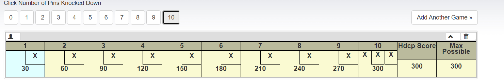
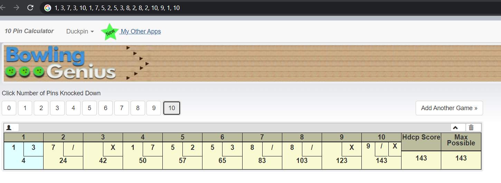

# Bowling Game Problem solution in c#
  **Bowling Game using C# / MsTest**

# Problem statement
  

# How to Keep Score In Bowling
A game of bowling consists of 10 frames in which a player has two chances per frame to knock down all 10 pins.  If a player knocks down all 10 pins in the 10th frame, an extra throw is awarded (so you can have up to 3 throws in the 10th frame).

The basics of scorekeeping are quite easy - just add up the pins knocked down per frame.  For example, if on your first throw you knock down 6 pins, and then on the second throw you knock down 3, your total is 9 for the frame.  The exceptions to this are if you knock down all 10 pins on the first throw (a strike), or knock all 10 pins down in two throws (a spare).

## How spares are scored

Throwing a spare awards the player with 10 points plus the number of pins knocked down on the next throw.  For example, if you throw a spare in the first frame, and then an 8 and 1 in the second frame, your total for first frame would be 18.  If you throw a spare in the first frame, followed by a strike in the second frame, your score would be 20 for the first frame.

## How strikes are scored

Throwing a strike awards the player with 10 points plus the total of the next **two** throws.  For example, if you throw a strike in the first frame, and then an 8 and 1 in the second frame, your total for first frame would be 19.  If you throw a strike in the first frame, followed by a strike in the second and third frames, your score would be 30 for the first frame.

# The Goal
The goal of this kata is to use a test driven design (TDD) approach to successfully score a game of bowling.  You'll want to create the following:
* A Game class that has two methods
  * roll(int pins) each time a ball is rolled
  * int GetScore() is called at the end of the game to give a total score

# Example
- Perfect game **10, 10, 10, 10, 10, 10, 10, 10, 10, 10, 10, 10**
  
- random example with input **1, 3, 7, 3, 10, 1, 7, 5, 2, 5, 3, 8, 2, 8, 2, 10, 9, 1, 10**

  

# Hints
At a minimum you'll want to use the following tests:
* Test for all gutterballs (knocked down 0 pins for the entire game.  Total Score == 0)
* Test for knocking down 1 pin each time (Total Score == 20)
* Test a perfect game (knocked down 10 pins each throw, Total Score == 300)

If you want some extra credit or practice, create a method that allows you to play a random game and make sure the score it correct.  You can check by using the calculator [here](http://www.bowlinggenius.com/).

# Resources
Additional credit is due to [Uncle Bob Martin](http://butunclebob.com/ArticleS.UncleBob.TheBowlingGameKata) who explains how to solve this.